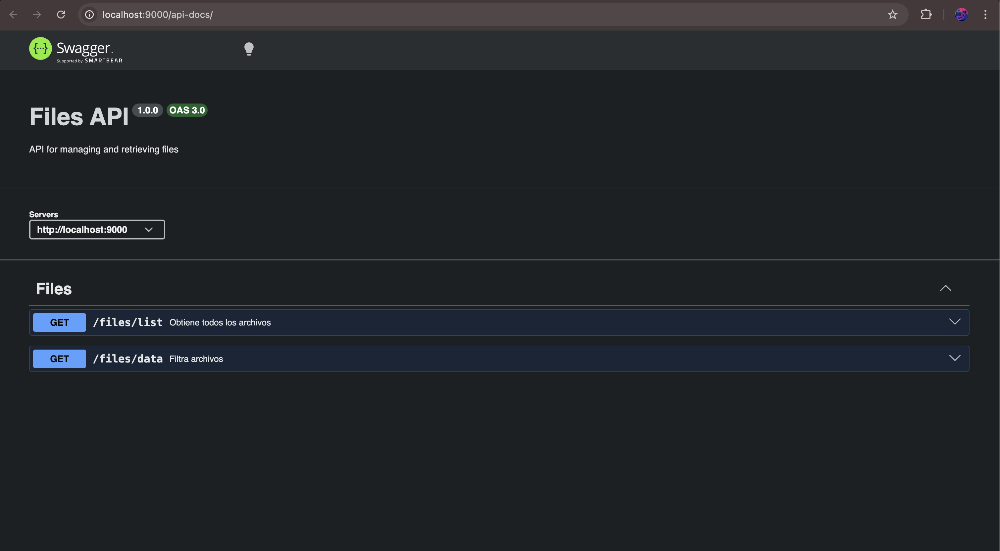
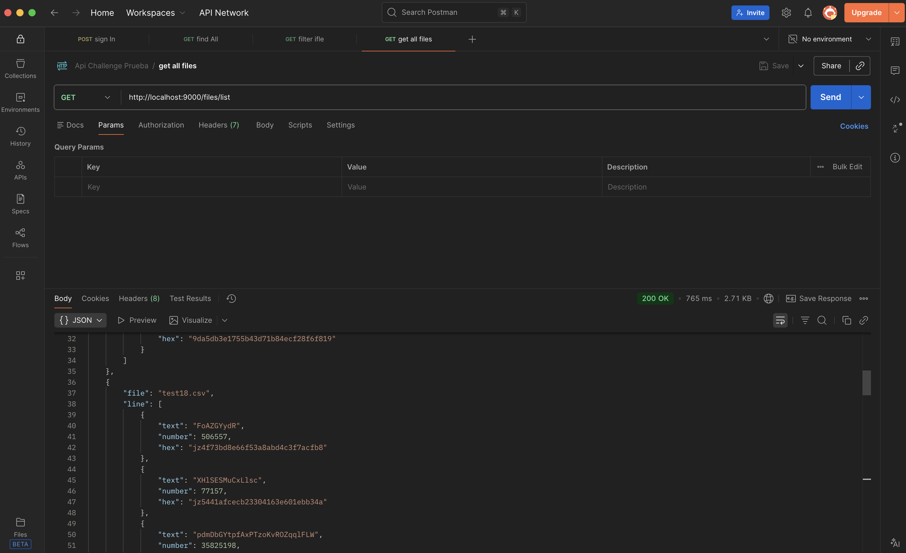
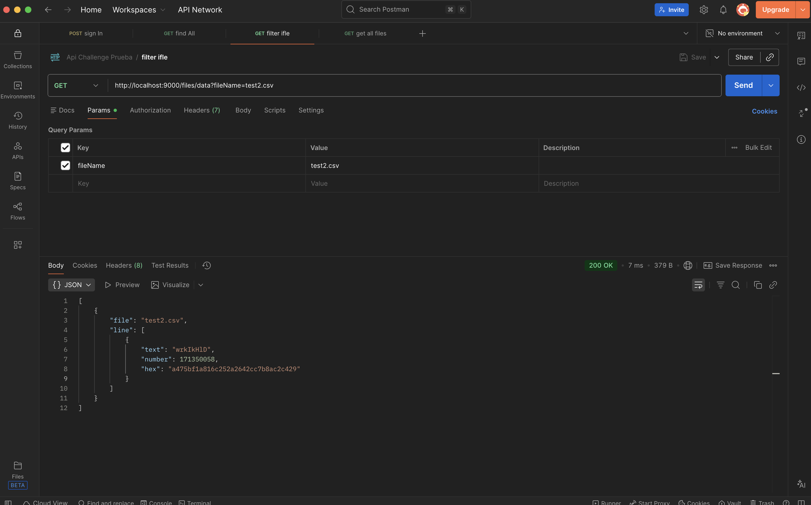
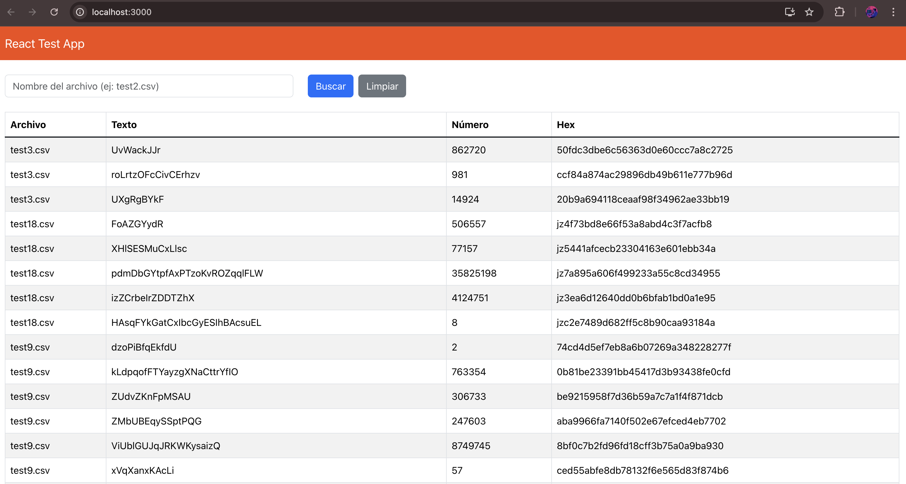
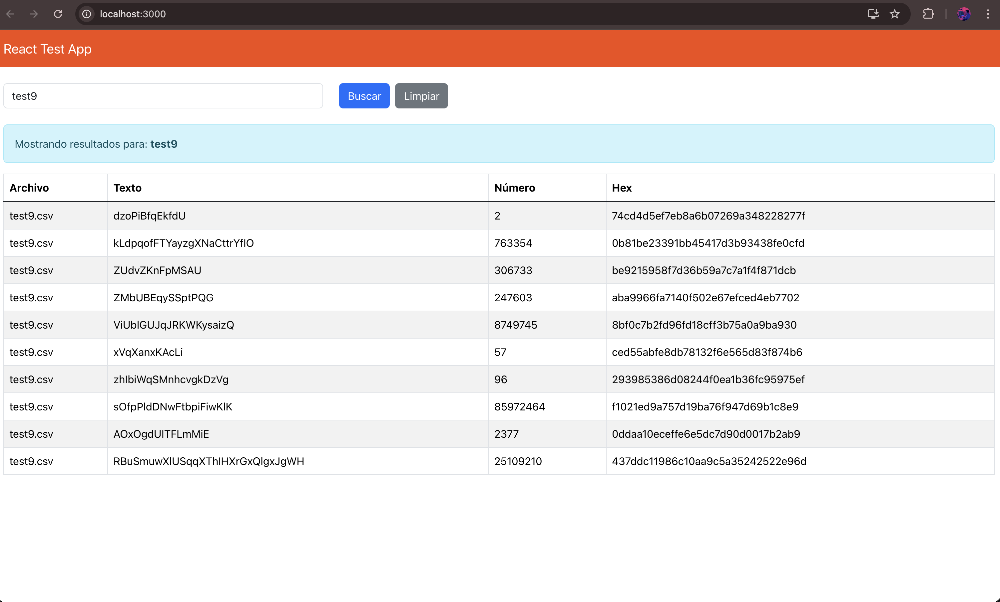
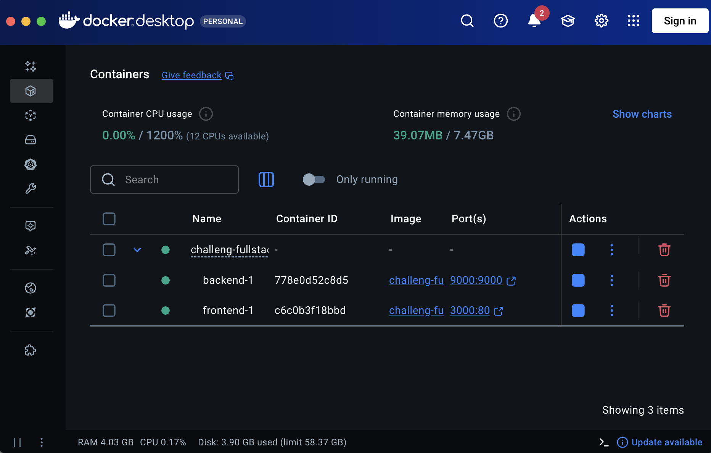

# Challenge Fullstack - CSV File Viewer

Aplicación fullstack para visualizar y gestionar archivos CSV.

## 🚀 Inicio Rápido

### Requisitos Previos

- [Docker](https://www.docker.com/get-started) instalado
- [Docker Compose](https://docs.docker.com/compose/install/) instalado

### Instalación

1. **Clonar el repositorio:**

```bash
git clone <url-del-repositorio>
```

2. **Entrar a la carpeta del proyecto:**

```bash
cd challeng-fullstack
```

3. **Levantar los servicios con Docker:**

```bash
docker-compose up --build
```

O en segundo plano:

```bash
docker compose up -d
```

## 🌐 URLs de Acceso

| Servicio             | URL                                                              | Descripción                     |
| -------------------- | ---------------------------------------------------------------- | ------------------------------- |
| **Backend API Docs** | [http://localhost:9000/api-docs](http://localhost:9000/api-docs) | Documentación Swagger de la API |
| **Frontend**         | [http://localhost:3000](http://localhost:3000)                   | Interfaz de usuario             |

> ⚠️ **Nota:** El puerto `3000` es el puerto por defecto de React. Si tienes otro servicio corriendo en ese puerto, puedes modificarlo en el archivo `docker-compose.yml`.

## 📁 Estructura del Proyecto

```
├── backend/          # API REST con Node.js/Express
├── frontend/         # Aplicación React
├── docker-compose.yml
└── README.md
```

## 🛠️ Comandos Útiles

```bash
# Levantar servicios
docker-compose up --build

# Levantar en segundo plano
docker compose up -d

# Ver logs
docker-compose logs -f

# Detener servicios
docker-compose down

# Reconstruir contenedores
docker-compose build --no-cache
```

## 📖 Documentación Adicional

- [Backend README](./backend/README.md)
- [Frontend README](./frontend/README.md)

## 📸 Capturas de Pantalla

### Backend - Swagger API Docs



### Backend - Listar Archivos



### Backend - Filtrar Archivos



### Frontend - Listar Archivos



### Frontend - Filtrar Archivos



### 🐳 Prueba Extra - Docker


